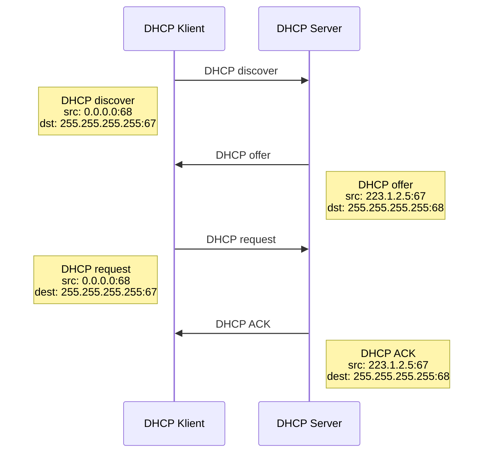

---
tags:
  - škola/VŠ/VUT/ISA
aliases:
---
= Dynamic host configuration protocol

Komunikace na principu klient-server, kde klienti jsou počítače, které žádají router [[IP adresa|IP adresu]] a serverem je program/software (většinou na router poskytující spojení v LAN)

# Komunikační protokol

## DHCP discover
Klient DHCP posílá dotaz na port 67 formou broadcastu, zdrojovou [[IP adresa|IP adresu]] uvede jako 0.0.0.0

## DHCP offer
Jedná se o odpověď serveru, pokud běží více serverů na síti, klient si vybírá jeden z nich, zpráva obsahuje nabízenou [[IP adresa|IP adresu]], síťovou masku a dobu zapůjčení adresy (lease time), případné zamítnutí se dělá zprávou DHCP NAK

## DHCP request
Klient na nabídku odpovídá, zprávu posílá opět broadcastem aby ho slyšely všechny DHCP servery, případné ostatní servery po tomto okamžiku zruší své nabídky. V případě expiraci (lease) klient posílá tuto zprávu a dostává od serveru stejnou [[IP adresa|IP adresu]] na novou dobu.

## DHCP ACK
Server potvrzuje přijetí volby a přiděluje [[IP adresa|IP adresu]] na danou dobu