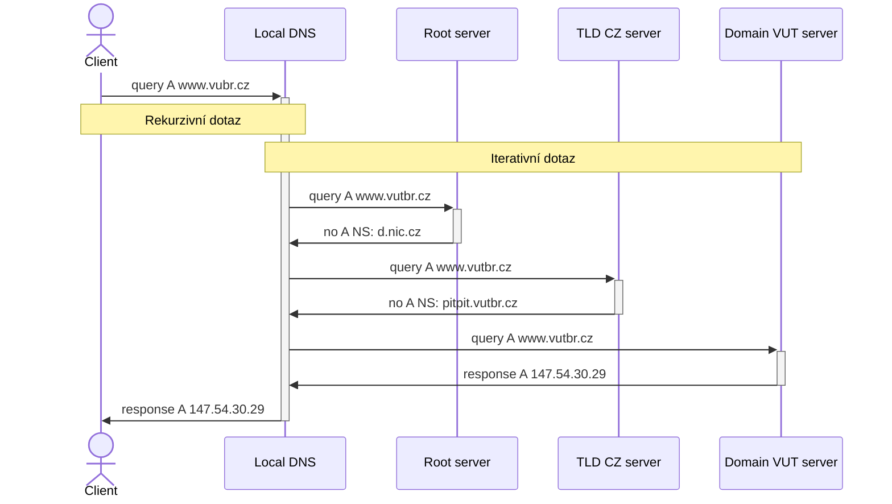
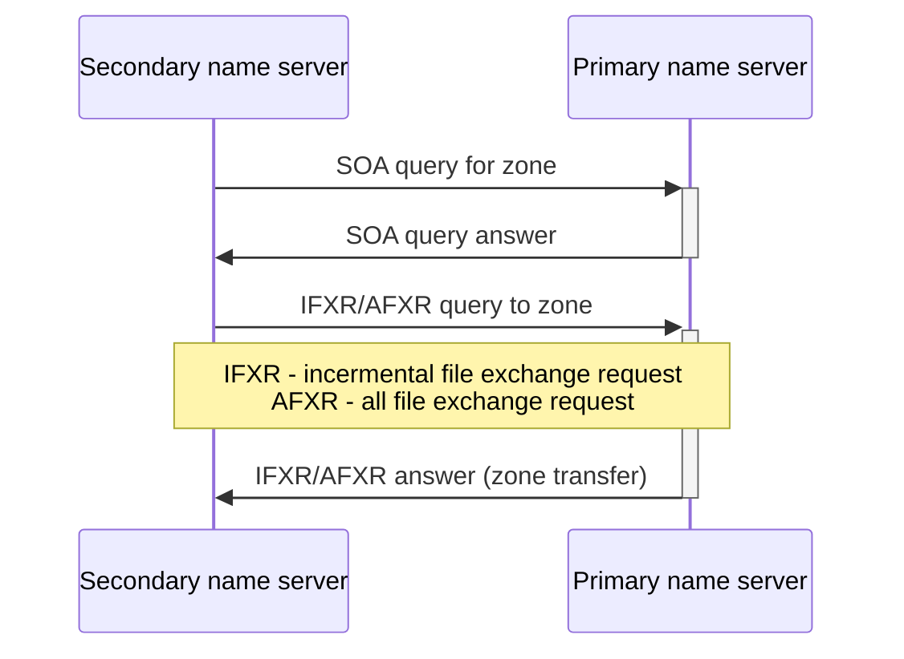

---
tags:
  - škola/VŠ/VUT/ISA
aliases:
---

# Popis protokolu
- Jedná se o aplikační protokol nad [[UDP]] ([[TCP]] v případě přenosu zón) na portu 53
## Zpráva obsahuje:
- Hlavičku
- Dotaz
- Odpověď
- Authority sekci
- Additional

![[DNS protokol-2024-12-16--19-45-12-1E288D120502A7DAEC128AD62A69F55A.png]]
# Rezoluce DNS
- Klient, který chce vykonat rezoluci domény má od DHCP přidělený server (a nebo ho má v systému natvrdo nastavený)
- dotáže se tedy lokálního DNS serveru, pokud již nemá v cache výsledek
- Lokální DNS server pokud také nemá v cache výsledek se začne postupně dotazovat root serverů na dotaz, k zjištění [[IP adresa|IP adresy]] root serveru má speciální zónový soubor named.root se zónou hint

# Přenos zón
- probíhá **mezi sekundárním a primárním serverem**
- sekundární využívá metodu pooling a vyzývá primární server o nová data, podle refresh intervalu v SOA záznamu
- lze použít ==DNS notify== (z masteru na slave)
