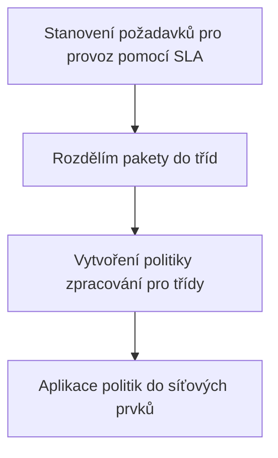

---
tags:
  - škola/VŠ/VUT/ISA
aliases:
---
- Provádí značení IP packetů a jejich následnou prioritizaci podle značení
- metoda funguje na úrovni toků, narozdíl od [[IntServ]], která funguje na úrovni celých toků
- konkrétně se dívá na ToS bajt v [[IP paket]], ==čím vyšší číslo, tím vyšší priorita==
- Používají ISP, zákazník data označovat nemusí

> [!Warning] Nejedná se o on-demand řešení pro priority. 
> ISP si musí jednotlivé třídy definovat předem
> Narozdíl od [[IntServ]], kde dochází předem k žádosti o rezervaci zdrojů

# Funkce
- okrajové síťové prvky sítě podporujcící diffserv všechny pakety označí všechny příchozí pakety klasifikací priority
- následně dochází ve vnitřních uzlech k přeposílání na základě stanovených priorit

# Třídy
- EF (expected forwarding) - malá latence a packet loss
- AF (assured forwarding) - garance ==min. přenosového pásma== (lowest bandwidth)

- CF (class selector) - 8 tříd, které si může ISP nadefinovat
- BE (best effort) - žádná používaná metoda priority
# Implementace v praxi
