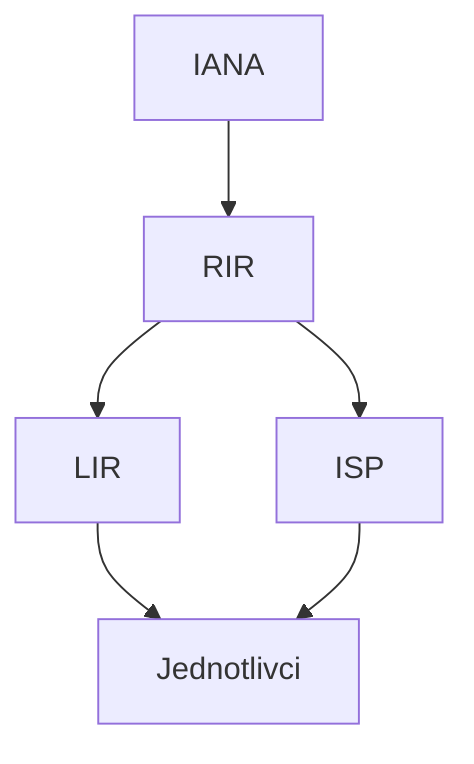

---
tags:
  - škola/VŠ/VUT/ISA
aliases:
  - IP adres
  - IP adresy
  - IPv4
  - IPv6
  - IP adresu
---
IP adresy jsou centrálně spravované organizací [[IANA]]

Přidělují je regionální registrátoři ([[RIR]])

# Řetězec propůjčení adres

# IPv4
## Privátní adresy pro LAN sítě

| Počáteční adresa | Koncová adresa   | Prefix     |
| ---------------- | ---------------- | ---------- |
| 10.0.0.0         | 10.255.255.255   | 10/8       |
| 176.16.0.0       | 172.31.255.255   | 172.16/12  |
| 192.168.0.0      | 1921.168.255.255 | 192.168/16 |

## Třídy IP Adres
![[IP adresa-2024-12-16--19-45-09-6EFA133D898EF07DB2B55BF1077B52D3.png]]

# IPv6

- 128bit hexadecimální číslice tvořící čtevřice, tzn 8 čtveřic
- aaaa:bbbb:cccc:dddd:eeee:ffff:1111:2222
- nejdelší posloupnost nul se zkracuje :: od leva
![[IP adresa-2024-12-16--19-45-09-28B5AD10DBE1492E964B3C5EC899A2F0.png]]