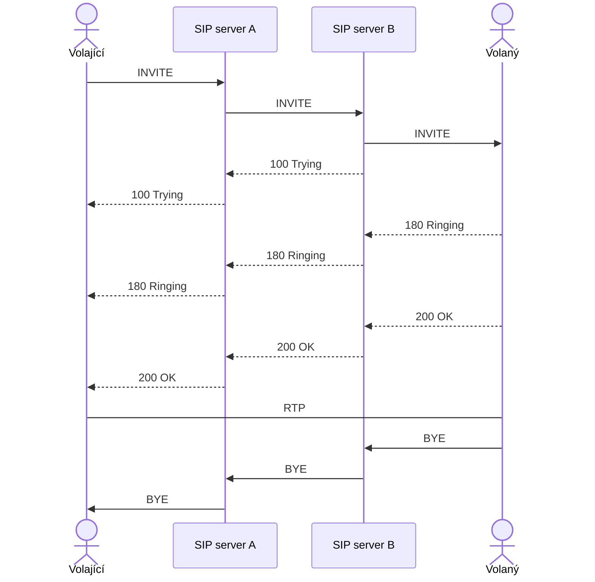

---
tags:
  - škola/VŠ/VUT/ISA
aliases:
---
= signal initialization protocol

# Povinnosti protokolu
- registruje uživatele a zařízení do sítě
- uskutečňuje hovory a ukončuje je
- vytváření spojení mezi účastníky prostřednictvím serveru nebo metodou peer-to-peer
- **Stará se pouze o správu před vytvořením hovoru, po vytvoření již nemá za hovor správu!**

# Zprávy (metody) protokolu

- REGISTER
- INVITE společně s [[SDP]]
- OK společně s [[SDP]]
- ACK
- CANCEL
- BYE
# Process spojení při registraci
![[SIP-2024-12-16--19-45-10-EDB62DEBE8549437D285F7CF564C7CF7.png]]
# Proces spojení při volání

