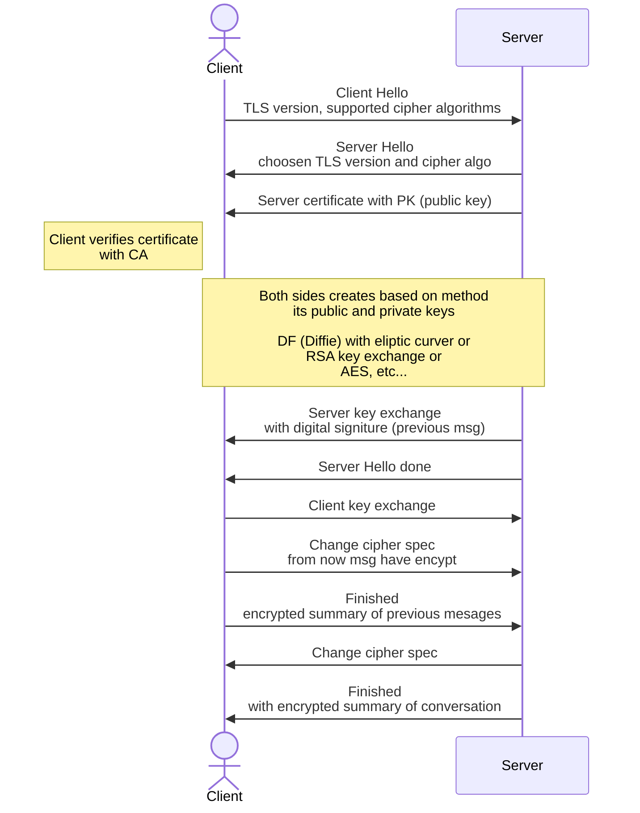

---
tags:
  - škola/VŠ/VUT/ISA
aliases:
  - tls
---
= Transport layer security

- Pracuje nad [[OSI model#Transportní vrstva (L4)|L4]] vrstvou
- zabezpečuje vrstvy nad sebou, zejména aplikační a jejich protokoly
- Při vytváření spojení si strany vyměňují klíče asynchronní kryptografií pomocí DH nebo RSA
- po výměně symetrického klíče dochází ke komunikaci symetrickou kryptografií
# Handshake
